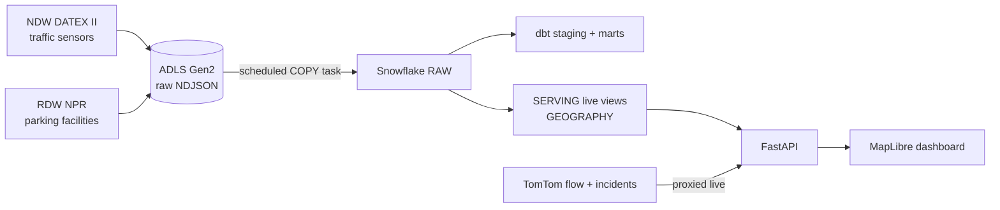

# CookedCommute

> *How cooked is your commute — and where can you park it?*

A real-time mobility dashboard for **Amsterdam**, built on an automated **Azure → Snowflake**
data pipeline. It shows live traffic flow on every street, measured congestion from the
national sensor network, active road incidents, and the nearest parking — refreshed
hands-free on a schedule.


## What it does

- **Live traffic** — every street coloured by real-time speed-vs-free-flow (TomTom flow
  tiles), overlaid with measured congestion from the Dutch national road sensors (NDW),
  plus an average-speed / "% heavy" summary.
- **Incidents** — live closures, jams and roadworks (TomTom) as clickable warning markers,
  so a red road is explained by whatever is causing it.
- **Parking near you** — a GPS-first map of off-street parking facilities (RDW NPR),
  ranked by distance from where you are.

Two views (Traffic / Parking), light & dark themes, and a pin for your location.

## Architecture

The warehouse data (NDW traffic + RDW parking) flows through a fully automated **ELT**
pipeline; the real-time vendor layers (TomTom flow + incidents) are proxied live by the API.



1. **Ingest** — Azure Functions (Python, timer triggers) fetch NDW traffic every 5 min and
   RDW parking daily, landing date-partitioned raw NDJSON to ADLS Gen2 via the Function
   App's **managed identity** (no secrets in code).
2. **Load** — a Snowflake **storage integration** + external stage read the lake; a
   scheduled **TASK** runs `COPY INTO` into `RAW` every 5 min (idempotent — already-loaded
   files are skipped).
3. **Transform** — **dbt** builds typed staging views and marts (`fct_traffic_intensity`,
   `dim_parking_facility`) with data-quality tests.
4. **Serve** — SQL `SERVING.LIVE_*` views return the latest row per entity with a
   `GEOGRAPHY` point for nearest-garage distance queries.
5. **Dashboard** — **FastAPI** serves GeoJSON endpoints (and proxies the TomTom tiles so the
   API key stays server-side) to a **MapLibre GL** frontend.


## Tech stack

| Layer | Tools |
|---|---|
| Ingestion | Python (`requests`, `lxml` streaming DATEX II parse), Azure Functions (timer triggers, managed identity) |
| Data sources | NDW (national traffic sensors), RDW NPR (parking), TomTom Traffic (flow tiles + incidents) |
| Lake | Azure Data Lake Storage Gen2 (raw NDJSON, date-partitioned) |
| Warehouse | Snowflake — storage integration + external stage, scheduled COPY task, key-pair auth, `GEOGRAPHY` / `QUALIFY` live views |
| Transform | dbt (dbt-snowflake) — staging → marts + tests |
| API / dashboard | FastAPI + MapLibre GL (Carto basemaps, Tailwind) |
| Infra / CI | Terraform (Azure), GitHub Actions (ruff, pytest, dbt parse) |

## Repo layout

```
ingestion/        fetch + parse sources, land raw to lake/ADLS
azure_functions/  timer-triggered Functions that run the ingestion in the cloud
snowflake/        bootstrap DDL + ADLS storage integration / stage / COPY task
dbt/              staging views + marts + tests
backend/          FastAPI: GeoJSON endpoints + TomTom tile/incident proxy
frontend/         MapLibre GL single-page dashboard
infra/            Terraform: ADLS, Function App, identity, observability
tests/            parser + logic unit tests
```

## Run it locally

Prereqs: Python 3.11+, a Snowflake account, a free TomTom key. (The cloud pipeline also
needs Azure + Terraform + Azure Functions Core Tools.)

```bash
python -m venv venv && source venv/bin/activate    # Windows: venv\Scripts\activate
pip install -r requirements.txt

# copy .env.example -> .env and fill in your Snowflake + TomTom values
python scripts/gen_snowflake_key.py                # generate the key-pair, then register it in Snowflake

# one ingestion cycle -> lake, then load into Snowflake RAW
python -m ingestion.pipeline --once
python -m ingestion.warehouse

python scripts/run_dbt.py build                    # build the dbt marts
uvicorn backend.api:app --reload                   # dashboard at http://localhost:8000
```

Cloud setup (Snowflake objects, Azure infra, Function deploy) lives in `snowflake/`,
`infra/`, and `azure_functions/`.
